# Boston Pizza Sales Analysis

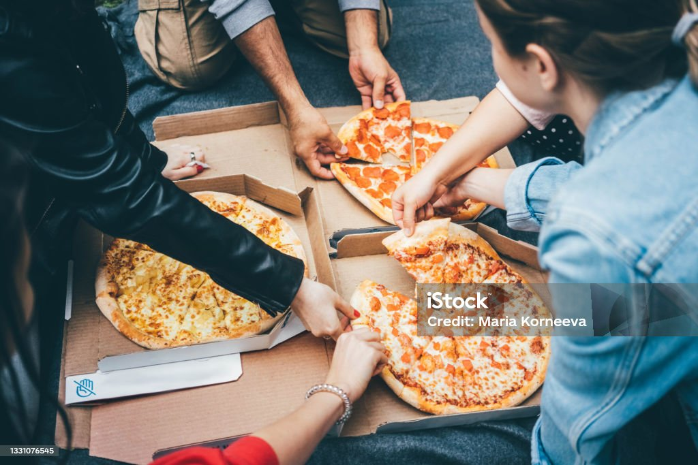

## Introduction
This is a power BI project on sales analysis of an imaginary store called **Boston Pizza**. It is a year worth of sales from a fictitious pizza place. The project is to analyze and derive insights to answer crutial questions and help the store make data driven decisions.

_*Disclimer_*: _*All datasets and reports do not represent any company or store.*_

## Recommended Analysis
1.	How many customers do we have each day? Are there any peak hours?
2.	How many pizzas are typically in an order? Do we have any bestsellers?
3.	How much money did we make this year? Can we indentify any seasonality in the sales?
4. Are there any pizzas we should take of the menu, or any promotions we could leverage?

## Skills demostrated
The following Power BI features were incorporated: Data cleaning, Bookmarking, DAX, Modelling, Filters.

## Data gathering
The dataset was downloaded on Maven Analytics website. Here is the link to the [dataset](https://www.mavenanalytics.io/data-playground?dataStructure=2lXwWbWANQgI727tVx3DRC&search=pizza)
It consists of four datasets namely:
- Orders
- Order_details
- Pizzas
- Pizza_types

## Data Transformation/data cleaning
The underscore for the column header was removed. The first row of the pizza types dataset was promoted as row header.

Pizza types before cleaning            |          Pizza types after cleaning
:-------------------------------------:|:----------------------------------------:|
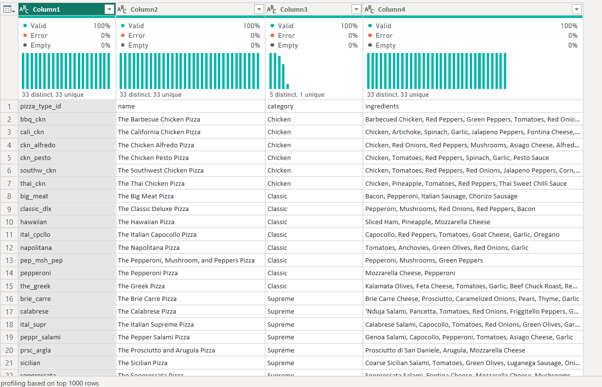       |  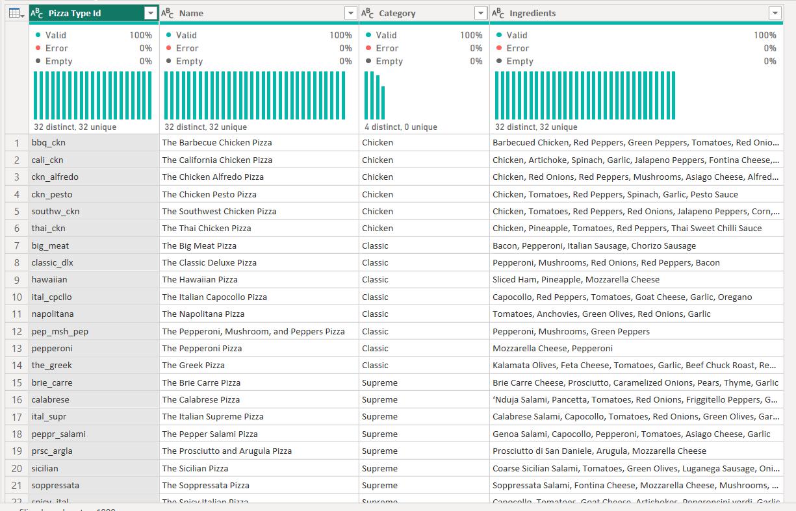

Pizza before cleaning                  |          Pizza after cleaning
:-------------------------------------:|:----------------------------------------:|
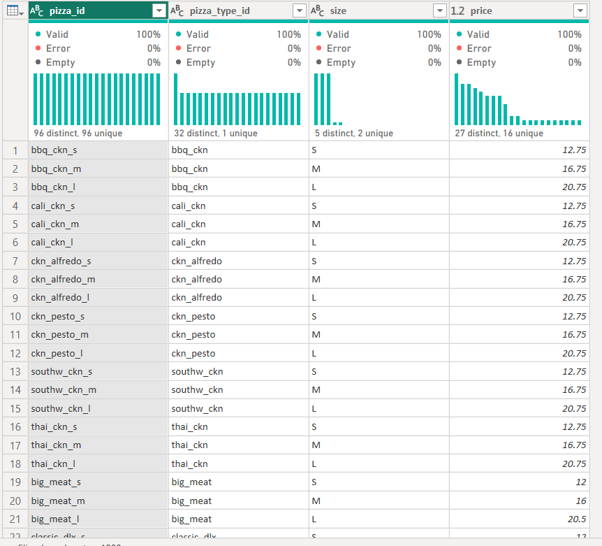             |   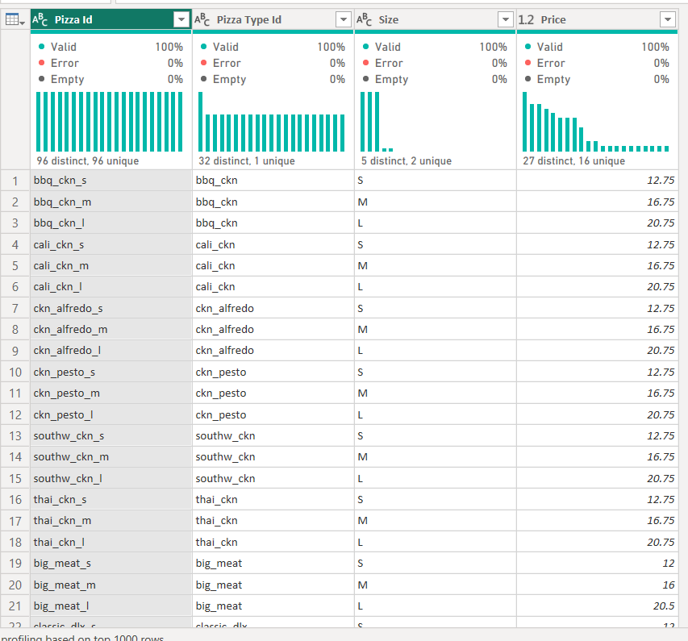

Order details before cleaning          |          Order details after cleaning
:-------------------------------------:|:------------------------------------------------:|
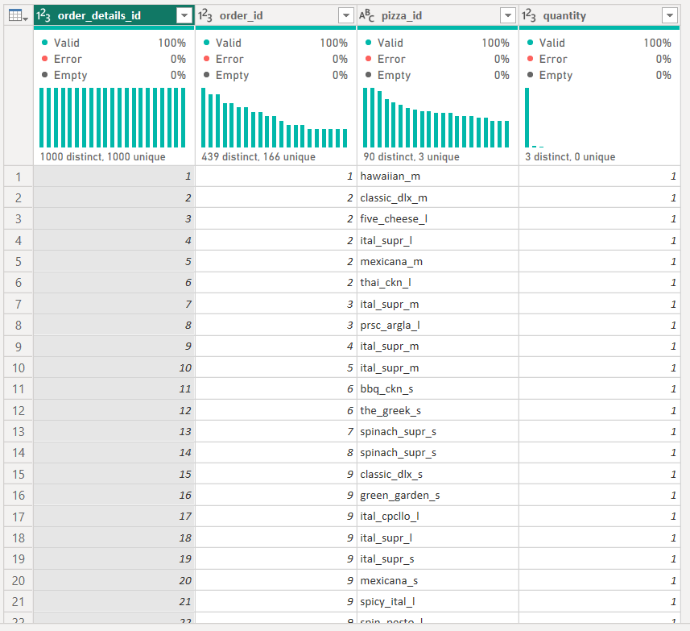     |   

Order before cleaning                  |          Order after cleaning
:-------------------------------------:|:------------------------------------------------:|
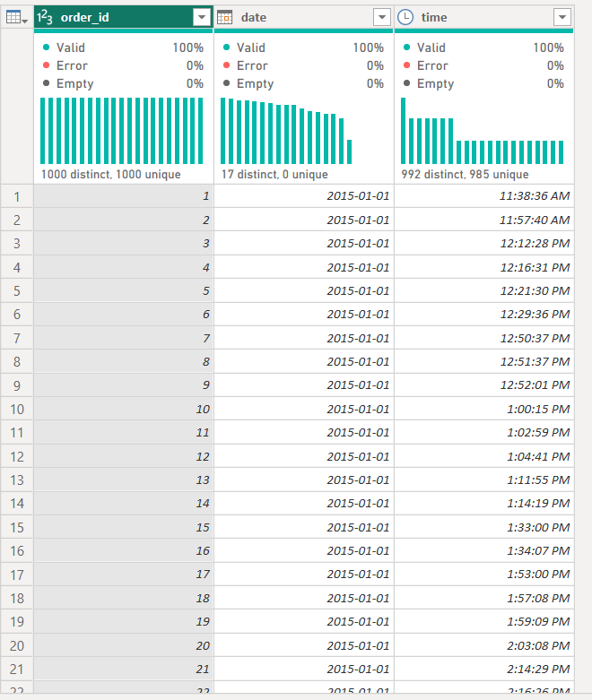             |   

- The datatype for each column header was checked and edited as appropriate. Null value was checked for each column header by checking the column quality. If the valid of each column is less than 100% it means that the row contains Null value. But for the four datasets all the valid values were 100% it means that there is no missing or Null value.

- New measures were created to calculate the total sales, Orders, Average orders in a day, Avg pizzas in an order respectively.

Total Sales                            |          Orders
:-------------------------------------:|:------------------------------------------------:|
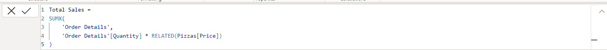                   |   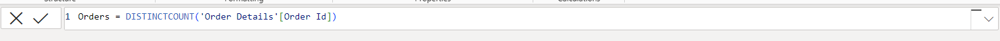

Average Order in a day                      |          Average Pizzas in a day
:------------------------------------------:|:------------------------------------------------:|
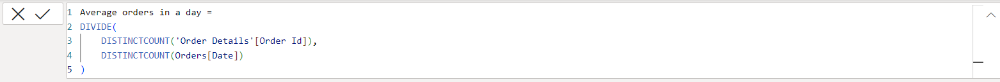                      |   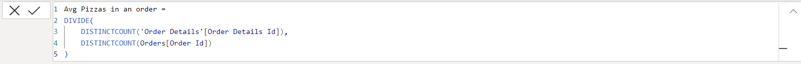

## Data Modelling

Date table was created using the below code:

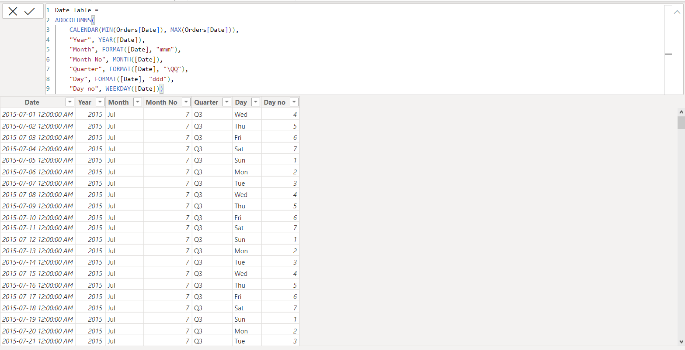

Relationship was created within the five datasets. 

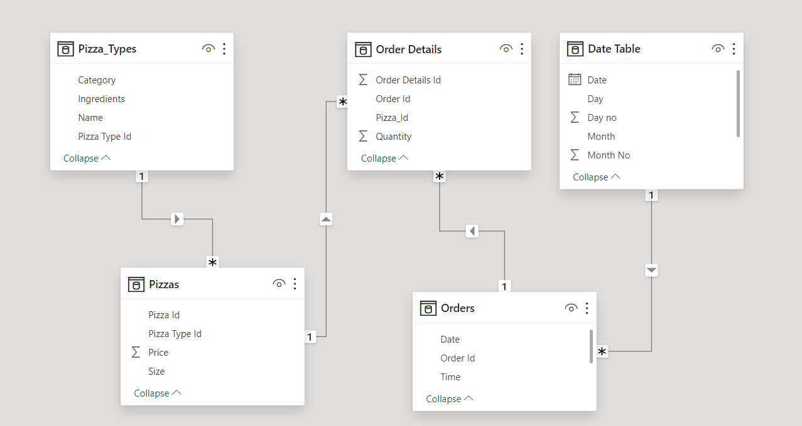
The model is a star schema. There are 4-dimention tables and 1 fact table. Order details is the fact table because it contains the quantitative data being analyzed.

## Analysis
The store has a total number of 21,350 orders.
The average number of customer in a day is 60.
The peak hour is between 12 - 3pm respectively.

Average number of customer             |          Peak Hour
:-------------------------------------:|:------------------------------------------------:|
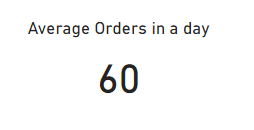                 |   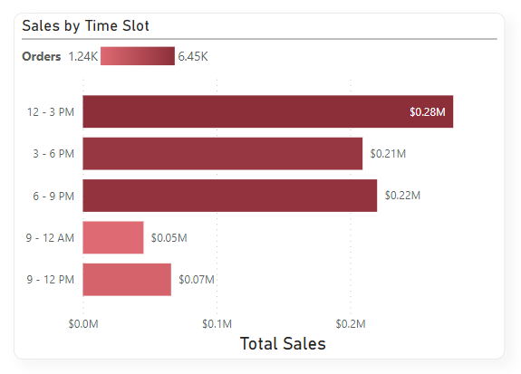

The amount of pizzas typically in an order is two. The best seller is the Thia chicken pizza with the total sales of 43,434.

Pizza in an order                      |          Best Seller
:-------------------------------------:|:------------------------------------------------:|
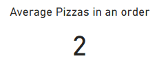                      |   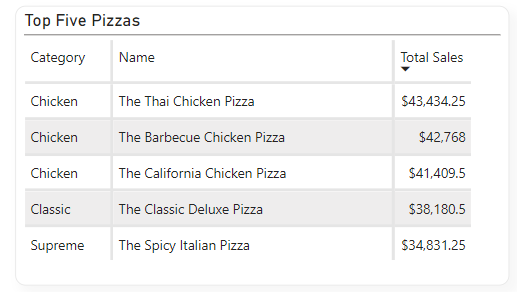

The total sales is 817,860. The suggested seasonality period will be the month of July where we have the total sales of $72,000.

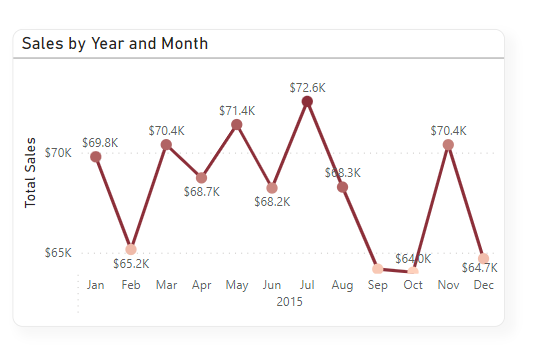

The least five pizzas based on sales are: The Spanach Pesto Pizza with 15,596, The Mediterranean Pizza with 15,361, The Spanish Supreme Pizza with 15,278, The Green Garden Pizza with 13,956, and The Brie Carre Pizza with 11,588. 

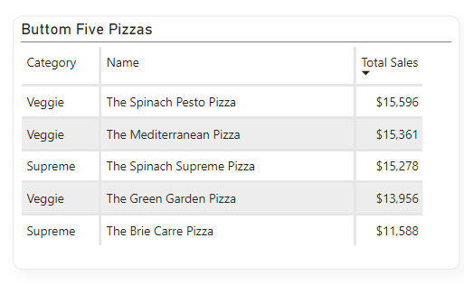

Sales by category:
The highest category was Classic with total sales of $220,000.

## Conclusion
Based on the pizza with the least sales the pizza that should be take off the menu is The Brie Carre Pizza with $11,588 worth of sales.

## Recommendation
For a deep dive into the analytics, the datasets of the previous years will be required for comparison and data driven decision.
